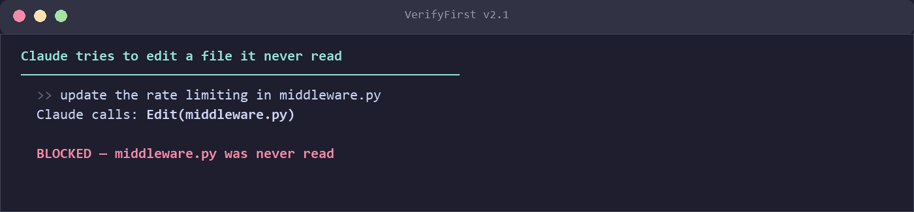

<h1 align="center">attnroute</h1>
<h3 align="center">Intelligent Context Routing for Claude Code</h3>
<p align="center"><strong>Intelligent Context Selection | Fast per-prompt injection | Zero Config Required</strong></p>

<p align="center">
  <a href="https://opensource.org/licenses/MIT"></a>
  <a href="https://www.python.org/downloads/"></a>
  <a href="https://github.com/jeranaias/attnroute/actions/workflows/ci.yml"></a>
</p>

<p align="center">
  
  
  
</p>

<p align="center">
  <strong><a href="#quick-start">Quick Start</a></strong> ·
  <strong><a href="#how-it-works">How It Works</a></strong> ·
  <strong><a href="#benchmarks">Benchmarks</a></strong> ·
  <strong><a href="#cli-reference">CLI Reference</a></strong>
</p>

<p align="center">
  <code>pip install attnroute && attnroute init</code><br>
  <em>Works immediately — no restart needed. Zero dependencies.</em>
</p>

<p align="center">
  
</p>

---

## Plugins in Action

attnroute ships with **4 behavioral plugins** that run automatically — no config needed. Each one addresses a real Claude Code pain point reported by the community.

### VerifyFirst — Read before you write
> Tracks every file Claude reads. Flags violations when Claude edits a file it never read. Freshness labels degrade over time (fresh → aging → STALE).



### LoopBreaker — Stop repeating yourself
> Detects when Claude is stuck making the same failing edit. After 5 attempts, injects a "stop and reconsider" intervention with concrete alternative strategies.


### BurnRate — Know your token budget
> Monitors real-time token usage, calculates burn rate, predicts when you'll hit rate limits. Optional daily/weekly budget alerts.


### ContextGuard — Survive compaction
> Predicts when context compaction is coming, then recovers your working file set after it happens. Cross-plugin flag marks all VerifyFirst reads as stale.


---

## Quick Start

### Option 1: Install from within Claude Code (Recommended)

Just ask Claude to install it for you:

```
You: "Install attnroute for this project"

Claude: pip install attnroute && attnroute init
```

Then type `/hooks` and approve the new hooks. **Done** - works immediately, no restart needed.

### Option 2: Install from terminal

```bash
# Install
pip install attnroute

# Initialize for your project
cd /path/to/your/project
attnroute init

# Start Claude Code
claude
```

```
Before attnroute:  Claude hunts for files via tool calls (variable token cost)
After attnroute:   Pre-selected relevant context injected (~2K tokens vs. full codebase)
```

---

attnroute is a **hook system for [Claude Code](https://github.com/anthropics/claude-code)** that automatically injects smart context into every prompt. Instead of Claude spending tool calls searching for relevant files, it gets the right files and symbols pre-loaded (thousands of tokens, fast).

**The core innovation**: attnroute maintains a "working memory" of your codebase—tracking which files you interact with, learning co-activation patterns, and using PageRank on dependency graphs to rank importance.

**Source code routing** (v0.7+): The search index covers your actual source tree, not just `.claude/*.md` docs. Source files matched by BM25 get tree-sitter outline injection (function signatures, class definitions, imports)—not raw file content. No config needed—just works.

### Verified Performance

| Metric | Value |
|--------|-------|
| **Context Compression** | 99.87% (Go, 556 files), 97.82% (Python, 30 files) |
| **Latency** | ~180ms warm per prompt (cold start higher with indexing) |
| **Context Precision** | HOT files get full content, WARM get symbols only |
| **Memory Overhead** | <100MB runtime footprint |

> **Note**: Compression is measured against all source files concatenated (theoretical maximum).
> Claude Code selectively reads files via tool calls, so real-world savings depend on your
> workflow. See [Benchmarks](#benchmarks) for methodology details.

---

## Table of Contents

1. [Plugins in Action](#plugins-in-action)
2. [The Problem](#the-problem)
3. [How It Works](#how-it-works)
   - [Attention Tracking](#attention-tracking)
   - [Heat Decay](#heat-decay)
   - [Co-activation Learning](#co-activation-learning)
   - [PageRank Ranking](#pagerank-ranking)
   - [Token Budgeting](#token-budgeting)
4. [Technical Architecture](#technical-architecture)
   - [The Three-Tier Context System](#the-three-tier-context-system)
   - [Search Strategies](#search-strategies)
5. [Benchmarks](#benchmarks)
   - [Methodology](#methodology)
   - [Results](#results)
   - [Comparison with Alternatives](#comparison-with-alternatives)
6. [Installation](#installation)
   - [Quick Install](#quick-install)
   - [Installation Options](#installation-options)
   - [Verifying Installation](#verifying-installation)
7. [Usage](#usage)
   - [Basic Usage](#basic-usage)
   - [CLI Reference](#cli-reference)
   - [Python API](#python-api)
   - [Configuration](#configuration)
8. [Optional Features](#optional-features)
   - [BM25 Search](#bm25-search)
   - [Semantic Search](#semantic-search)
   - [Graph-Based Retrieval](#graph-based-retrieval)
   - [Memory Compression](#memory-compression)
9. [Plugins](#plugins)
   - [VerifyFirst](#verifyfirst)
   - [LoopBreaker](#loopbreaker)
   - [BurnRate](#burnrate)
   - [ContextGuard](#contextguard)
   - [Plugin CLI](#plugin-cli)
10. [Troubleshooting](#troubleshooting)
11. [Contributing](#contributing)
12. [License](#license)
13. [Author](#author)
14. [Acknowledgments](#acknowledgments)

---

## The Problem

When you use Claude Code on a large codebase, it faces a fundamental challenge:

```
Your Codebase: 500+ files, 1.5 million tokens total
Claude's Context Window: 200K tokens (Sonnet) / 128K tokens (Haiku)
```

**What happens**: Claude uses tools to search and read files, but without knowing your current focus, it often:
- Reads files you don't need
- Misses files you do need
- Spends tokens hunting for the right context

**The result**: Slower responses, higher costs, and sometimes Claude misses the files that matter most.

### How attnroute Helps

Without attnroute, Claude uses tool calls to search and read files. This works, but it spends tokens hunting for the right context.

With attnroute, relevant files are **pre-selected and injected** into every prompt:

```
You: "Fix the bug in the auth module"

attnroute injects (~650 tokens):
  HOT:      docs/auth-guide.md   (full content, 400 tokens)
  WARM:     docs/api-reference.md (TOC, 100 tokens)
  HOT:SRC   src/auth.py          (outline: signatures, 120 tokens)
  WARM:SRC  src/session.py       (summary, 30 tokens)
```

**Key insight**: Source files get **outlines** (function signatures, class defs, imports), not full content. Claude's Read tool handles full content when needed -- attnroute gives it the map.

---

## How It Works

attnroute maintains a **working memory** of your codebase using five integrated systems:

```
┌──────────────────────────────────────────────────────────────────────────┐
│                          attnroute Pipeline                               │
├──────────────────────────────────────────────────────────────────────────┤
│                                                                          │
│   Your Prompt ──────┬─────────────────────────────────────────────────►  │
│                     │                                                    │
│                     ▼                                                    │
│   ┌─────────────────────────────────┐                                    │
│   │   1. Attention Tracking         │  ◄── Which files have you touched? │
│   │      (file access history)      │                                    │
│   └─────────────────┬───────────────┘                                    │
│                     │                                                    │
│                     ▼                                                    │
│   ┌─────────────────────────────────┐                                    │
│   │   2. Heat Decay                 │  ◄── Recent = HOT, old = COLD     │
│   │      (temporal relevance)       │                                    │
│   └─────────────────┬───────────────┘                                    │
│                     │                                                    │
│                     ▼                                                    │
│   ┌─────────────────────────────────┐                                    │
│   │   3. Co-activation Learning     │  ◄── Files used together get linked│
│   │      (pattern detection)        │                                    │
│   └─────────────────┬───────────────┘                                    │
│                     │                                                    │
│                     ▼                                                    │
│   ┌─────────────────────────────────┐                                    │
│   │   4. PageRank Ranking           │  ◄── Dependency graph importance  │
│   │      (graph-based importance)   │                                    │
│   └─────────────────┬───────────────┘                                    │
│                     │                                                    │
│                     ▼                                                    │
│   ┌─────────────────────────────────┐                                    │
│   │   5. Token Budgeting            │  ◄── Fit within context limits    │
│   │      (smart truncation)         │                                    │
│   └─────────────────┬───────────────┘                                    │
│                     │                                                    │
│                     ▼                                                    │
│   Enhanced Prompt with Smart Context ────────────────────────────────►   │
│                                                                          │
└──────────────────────────────────────────────────────────────────────────┘
```

### Attention Tracking

Every time Claude reads, edits, or references a file, attnroute records it:

```python
# Attention state (simplified)
{
    "src/auth.py": {
        "last_accessed": "2024-01-15T10:23:45",
        "access_count": 12,
        "edit_count": 3,
        "heat_score": 0.95
    },
    "src/config.py": {
        "last_accessed": "2024-01-15T09:15:00",
        "access_count": 5,
        "edit_count": 0,
        "heat_score": 0.72
    }
}
```

### Heat Decay

Files "cool down" over time. Recent interactions = HOT, old interactions = COLD:

```
Heat Score Over Time:

1.0 │  ███
    │  ███ ██
0.8 │  ███ ██ █
    │  ███ ██ ██ █
0.6 │  ███ ██ ██ ██ █
    │  ███ ██ ██ ██ ██ █
0.4 │  ███ ██ ██ ██ ██ ██ █
    │  ███ ██ ██ ██ ██ ██ ██ █
0.2 │  ███ ██ ██ ██ ██ ██ ██ ██ █
    │  ███ ██ ██ ██ ██ ██ ██ ██ ██ ██
0.0 └──────────────────────────────────► Time
      Now  -1h  -2h  -4h  -8h  -1d  -2d
```

**Decay formula**: `heat = base_heat * e^(-λ * time_since_access)`

### Co-activation Learning

Files accessed together in the same session get linked:

```
Co-activation Matrix (example):

              auth.py  session.py  routes.py  config.py
auth.py         -        0.85        0.42       0.31
session.py    0.85         -         0.38       0.25
routes.py     0.42       0.38          -        0.67
config.py     0.31       0.25        0.67         -
```

When you touch `auth.py`, attnroute automatically boosts `session.py` because they're frequently used together.

### PageRank Ranking

Using tree-sitter AST parsing, attnroute builds a dependency graph and ranks files by importance:

```
Dependency Graph:

    main.py ──────► auth.py ──────► session.py
       │              │                 │
       │              ▼                 │
       └──────────► utils.py ◄──────────┘
                      │
                      ▼
                  config.py

PageRank scores:
  config.py:  0.31  (imported everywhere)
  utils.py:   0.28  (central utility)
  auth.py:    0.18  (key module)
  session.py: 0.14  (supporting module)
  main.py:    0.09  (entry point, few inbound)
```

### Token Budgeting

attnroute fits injected context within configurable limits (default ~6K tokens). HOT files get full content or outlines, WARM files get compressed summaries. Files exceeding the budget are dropped by lowest score.

---

## Technical Architecture

### The Three-Tier Context System

| Tier | Score | Content | Example |
|------|-------|---------|---------|
| **HOT** | > 0.8 | Full file / outline | File you just edited |
| **WARM** | 0.25 - 0.8 | Symbols / TOC | File imported by HOT file |
| **COLD** | < 0.25 | Not injected | Unused files |

### Search Strategies

attnroute uses multiple search strategies, falling back gracefully:

| Strategy | Dependency | Speed | Quality | Use Case |
|----------|------------|-------|---------|----------|
| **BM25** | bm25s | Fast | Good | Keyword matching |
| **Semantic** | model2vec | Medium | Excellent | Concept matching |
| **Graph** | tree-sitter, networkx | Slow | Excellent | Dependency traversal |
| **Keyword** | None | Instant | Basic | Fallback when no deps |

```python
# Graceful degradation (internal logic)
def search(query: str) -> List[File]:
    if SEMANTIC_AVAILABLE:
        return semantic_search(query)  # Best quality
    elif BM25_AVAILABLE:
        return bm25_search(query)      # Good quality
    else:
        return keyword_search(query)   # Basic fallback
```

---

## Benchmarks

### Methodology

All benchmarks measured with:
- **Tokenizer**: tiktoken cl100k_base (same family as Claude)
- **Baseline**: All source files in repository concatenated (theoretical maximum)
- **attnroute output**: Context injected by RepoMapper for a sample query
- **Hardware**: Standard laptop (no GPU required)
- **Runs**: 3 runs, mean reported

> **Important**: The baseline is a **theoretical maximum** (all files concatenated), not how
> Claude Code actually works. Claude selectively reads files via tool calls, so the practical
> baseline is much smaller. These numbers measure attnroute's **compression effectiveness**,
> not a direct comparison to Claude Code's native behavior. See `benchmarks/README.md` for
> full methodology details.

### Results

| Repository | Files | Baseline Tokens | attnroute Tokens | Reduction | Time |
|:-----------|------:|----------------:|-----------------:|----------:|-----:|
| Go backend | 556 | 1,569,434 | 2,027 | **99.87%** | 309ms |
| Python lib | 30 | 94,991 | 2,072 | **97.82%** | 95ms |

### Prediction Accuracy

attnroute uses a dual-mode predictor to guess which files you'll need:

| Metric | Value | Notes |
|--------|-------|-------|
| **Precision** | ~45% | Of predicted files, 45% were actually used |
| **Recall** | ~60% | Of files used, 60% were predicted |
| **F1 Score** | 0.35-0.42 | Varies by project complexity |

> **Why F1 matters less than token reduction**: Even 35% F1 dramatically reduces context because:
> 1. Predicted files are ranked by confidence
> 2. Only top-k files are injected (HOT/WARM tiers)
> 3. Unpredicted files can still be Read by Claude on demand
> 4. The goal is reducing *unnecessary* context, not perfect prediction

The predictor improves over time as it learns your usage patterns. On a fresh install,
attnroute uses heuristics (git recency, import graphs, file timestamps) to provide
useful context immediately. The co-activation learner activates after ~25 turns of
observed usage and gets better from there.

### Run Your Own Benchmark

```bash
cd /path/to/your/project
attnroute benchmark

# Output:
# attnroute Benchmark Results
# ═══════════════════════════════════════════════════════════════
# Repository: your-project
# Files: 234
# Baseline tokens: 456,789
# attnroute tokens: 3,456
# Reduction: 99.24%
# Time: 187ms
# ═══════════════════════════════════════════════════════════════
```

### Comparison with Alternatives

| Approach | Context Reduction | Setup | Learning | Auto-context | Plugin System |
|----------|-------------------|-------|----------|--------------|---------------|
| **attnroute** | 97-99%* | Under a minute | Co-activation + PageRank | Per-prompt | 4 built-in |
| **Aider** repo map | 80-95% | Config file | No | Per-session | No |
| **Repomix** | 70-90% | Manual | No | No | No |
| **.claudeignore** (native) | 50-70% | Minutes | No | No | No |
| Manual file picking | 90%+ | Per-query | No | No | No |

> **Note**: Aider's repo mapping is the closest alternative — attnroute builds on the same
> tree-sitter + PageRank idea and adds usage-pattern learning, session lifecycle hooks, and
> behavioral plugins. The approaches are complementary: Aider targets its own chat interface,
> attnroute targets Claude Code.

---

## Installation

### Quick Install

**From within Claude Code** (no restart needed):
```
You: "Install attnroute for this project"
Then: /hooks → approve the new hooks
```

**From terminal**:
```bash
pip install attnroute
cd /path/to/your/project
attnroute init
claude  # start Claude Code
```

### Installation Options

```bash
# Core only (zero dependencies)
pip install attnroute

# With BM25 & semantic search
pip install attnroute[search]

# With tree-sitter & PageRank
pip install attnroute[graph]

# With Claude API memory compression
pip install attnroute[compression]

# Everything (Python 3.10-3.13 only — tree-sitter has no 3.14 wheels yet)
pip install attnroute[all]
```

> **Python 3.14**: Use `pip install attnroute` (base install). The `[all]` and `[graph]` extras
> require `tree-sitter-languages` which doesn't have Python 3.14 wheels yet.
> The core works fine on 3.14 with a regex fallback for AST parsing.

#### Dependency Breakdown

| Package | Size | Feature |
|---------|------|---------|
| **Core** | ~100KB | Attention tracking, basic search |
| **bm25s** | ~500KB | BM25 keyword search |
| **model2vec** | ~50MB | Semantic embedding search |
| **tree-sitter** | ~5MB | AST parsing for 14+ languages |
| **networkx** | ~2MB | PageRank on dependency graphs |
| **tiktoken** | ~2MB | Accurate token counting |

### Verifying Installation

```bash
attnroute status

# Output:
# attnroute Status
# ══════════════════════════════════════════════════════════════
# Version: 1.0.1
# Features:
#   ✓ BM25 search
#   ✓ Semantic search
#   ✓ Graph retrieval
#   ✓ Token counting (tiktoken)
# Keywords: .claude/keywords.json (not found - using defaults)
# Telemetry: 0 turns recorded
# ══════════════════════════════════════════════════════════════
```

---

## Usage

### Basic Usage

After running `attnroute init`, just use Claude Code normally:

```bash
claude
```

attnroute works invisibly in the background. Every prompt you send automatically includes intelligently-selected context.

### CLI Reference

```bash
# Setup & Status
attnroute init              # Set up hooks for current project
attnroute status            # Show configuration and features
attnroute validate          # Verify installation is working
attnroute version           # Show version info

# Reporting
attnroute report            # Token efficiency metrics
attnroute history           # View attention history
attnroute history --last 10 # Last 10 entries

# Testing
attnroute benchmark         # Run performance benchmarks
attnroute diagnostic        # Generate bug report

# Optional Features (require dependencies)
attnroute graph stats       # Dependency graph info
attnroute compress stats    # Memory compression stats
```

### Python API

```python
from attnroute import update_attention, build_context_output, get_tier
from attnroute import RepoMapper, Learner

# Update attention state for a prompt
state = update_attention(prompt="Fix the auth bug", conversation_id="session-1")

# Build context output (returns injected context string)
context = build_context_output(state)

# Check file tier classification
tier = get_tier(score=0.8)  # Returns "HOT", "WARM", or "COLD"

# Use RepoMapper for symbol extraction
mapper = RepoMapper("/path/to/project")
repo_map = mapper.build_map(token_budget=2000)
```

### Configuration

Create `.claude/keywords.json` in your project for better results:

```json
{
  "keywords": {
    "src/api.py": ["api", "endpoint", "route", "handler", "request", "response"],
    "src/models.py": ["model", "database", "schema", "orm", "query"],
    "src/auth.py": ["auth", "login", "logout", "session", "token", "password"],
    "src/config.py": ["config", "settings", "environment", "env"],
    "docs/api.md": ["api", "documentation", "reference", "endpoint"],
    "docs/setup.md": ["install", "setup", "configure", "getting started"]
  },
  "pinned": [
    "README.md",
    "src/config.py",
    "docs/overview.md"
  ]
}
```

- **keywords**: Map files to search terms that should activate them
- **pinned**: Files always included in context (regardless of heat score)

---

## Optional Features

### BM25 Search

Fast keyword-based search using BM25 algorithm.

```bash
pip install attnroute[search]
```

**What it does**: Matches prompt keywords to file content using BM25F field weighting. Filenames and paths are boosted 5x, symbol names (classes, functions) 3x, and file content 1x — based on Sourcegraph research showing +20% search quality improvement from field weighting.

**When it helps**: Finding files by specific function names, variable names, or technical terms.

### Semantic Search

Meaning-based search using embeddings.

```bash
pip install attnroute[search]  # Includes model2vec
```

**What it does**: Finds conceptually related files even if exact keywords don't match.

**When it helps**: "Fix the authentication bug" finds `session.py` even if the word "authentication" isn't in the file.

### Graph-Based Retrieval

Dependency-aware ranking using PageRank.

```bash
pip install attnroute[graph]
```

**What it does**: Parses AST with tree-sitter, builds dependency graph, ranks files by centrality.

**When it helps**: Understanding which files are "core" to your codebase vs. peripheral utilities.

**Supported languages**: Python, JavaScript, TypeScript, Go, Rust, Java, C, C++, Ruby, PHP, Swift, Kotlin, Scala, Haskell

### Memory Compression

Claude API-based observation compression (experimental).

```bash
pip install attnroute[compression]
```

**What it does**: Compresses tool outputs (file reads, command results) into semantic summaries for long-term memory.

**When it helps**: Multi-day coding sessions where you need to remember context from previous days.

---

## Plugins

attnroute includes a **plugin system** that extends Claude Code with behavioral guardrails. Plugins hook into the session lifecycle to monitor, guide, and protect your coding sessions.

Plugins hook into the session lifecycle: `SessionStart`, `UserPrompt` (pre/post), and `Stop`.

| Plugin | Purpose | Addresses |
|--------|---------|-----------|
| **VerifyFirst** | Enforces read-before-write policy | [GitHub #23833](https://github.com/anthropics/claude-code/issues/23833) |
| **LoopBreaker** | Detects repetitive failure loops | [GitHub #21431](https://github.com/anthropics/claude-code/issues/21431) |
| **BurnRate** | Predicts rate limit exhaustion | [GitHub #22435](https://github.com/anthropics/claude-code/issues/22435) |
| **ContextGuard** | Post-compaction amnesia prevention | Context compaction data loss |

All plugins are **enabled by default** and store state in `~/.claude/plugins/`.

---

### VerifyFirst

**Problem**: Claude sometimes makes speculative edits without first reading the file to understand context, leading to broken code or incorrect assumptions.

**Solution**: VerifyFirst tracks every file Claude reads and flags violations when edits are attempted on unread files.

**How it works**: Tracks every file Claude reads. If an edit is attempted on an unread file, it's flagged as a violation. Every prompt includes a list of "verified" files that are safe to edit:

```markdown
## VerifyFirst Policy
You MUST read a file before editing it.

**Files verified (safe to edit):**
- `auth.py`
- `session.py`
- `middleware.py`

**IMPORTANT:** For any file NOT in this list, use Read first.
```

**Violation logging**: All violations are logged to `~/.claude/plugins/verifyfirst_violations.jsonl` for analysis.

**v2.1 Features:**
- **Freshness tracking**: Each verified file is labeled `fresh`, `aging`, or `STALE` based on how many turns ago it was read
- **Edit velocity alerts**: Detects rapid edit-without-read patterns (speculative editing)
- **Cross-plugin integration**: Reacts to ContextGuard's compaction flag — marks all reads as stale after context compaction

---

### LoopBreaker

**Problem**: Claude sometimes gets stuck making "multiple broken attempts instead of thinking through problems" — repeating the same failing approach 3, 4, 5+ times.

**Solution**: LoopBreaker tracks tool call patterns and detects when Claude is repeating similar operations on the same file. When a loop is detected, it injects a "stop and reconsider" intervention.

**How it works**: Each tool call is converted to a signature for comparison:

```python
signature = f"{tool}|{normalized_path}|{key_identifiers}|{command}"

# Examples:
"Edit|/src/auth.py|def:login:session:token|"
"Bash|/src/auth.py||pytest"
```

**Intervention context**: When a loop is detected, the next prompt includes:

```markdown
## LoopBreaker Alert
**WARNING:** You've attempted to modify `auth.py` 3 times with similar approach.

**STOP and reconsider your approach:**
1. Re-read the file to verify your understanding
2. Check if you're solving the RIGHT problem
3. Consider a completely different approach
4. If stuck, ask the user for clarification

**Do NOT repeat the same fix.** Try something fundamentally different.
```

**Loop breaking**: The loop clears automatically when Claude:
- Works on a different file
- Uses a fundamentally different approach (different signature)
- Only reads without writing (exploration mode)

**v3.0 Features:**
- **Git progress detection**: Uses `git diff` to detect zero-change loops — edits that don't actually persist
- **Multi-metric severity**: Combines signature repetition, failure count, and git progress into a 0-1 composite score
- **State machine**: `detected` → `escalated` → `cooling` stages with automatic cooldown after idle turns

---

### BurnRate

**Problem**: Users report 10x variance in quota consumption rates, hitting rate limits unexpectedly with no warning.

**Solution**: BurnRate monitors token usage from Claude Code's stats cache, calculates a rolling burn rate (tokens/minute), and predicts when you'll exhaust your quota.

**How it works**: Reads `~/.claude/stats-cache.json`, calculates a rolling burn rate (tokens/minute), and predicts when you'll exhaust your quota.

**Warning thresholds**:

| Level | Trigger | Action |
|-------|---------|--------|
| Normal | >30 min remaining | No warning |
| **WARNING** | 10-30 min remaining | Inject warning context |
| **CRITICAL** | <10 min remaining | Inject urgent warning + suggestions |

**Critical warning context**:

```markdown
## BurnRate CRITICAL
**Estimated time until rate limit: ~8 minutes**

- Current burn rate: 2,150 tokens/min
- Tokens used this window: 142,000
- Window limit: 150,000

**Consider:**
- Pausing for a few minutes to let the window slide
- Switching to a smaller model (Haiku) for simple tasks
- Breaking work into smaller, focused prompts
```

**Plan detection**: BurnRate auto-detects your plan type based on usage patterns:

| Plan | Token Limit (5-hour window) | Detection |
|------|----------------------------|-----------|
| Free | 25,000 | Low sustained usage |
| Pro | 150,000 | Default assumption |
| Max 5x | 500,000 | >100K session tokens |
| Max 20x | 2,000,000 | >300K session tokens |
| API | Unlimited | Model name contains "api" |

**v1.0 Features:**
- **Budget alerts**: Configure daily/weekly token budgets in `~/.claude/plugins/config.json` — warning at 80%
- **Usage export**: `export_usage(format="csv", days=7)` for external analysis or billing reconciliation
- **Weekly summaries**: Automatic per-model token breakdown, generated once per day

---

### ContextGuard

**Problem**: When Claude Code's context window fills up (~95%), it compacts the conversation, losing all injected state including file context. This is the #1 community pain point — Claude "forgets" what it was working on.

**Solution**: ContextGuard monitors the active file count across turns. If it detects a sudden drop (50%+), it re-injects a compact recovery block listing the key files from before compaction.

**How it works**: Every turn, ContextGuard snapshots the top 15 files with attention score >= 0.25. If the active count drops by 50%+ in a single turn (the compaction signature), it injects:

```markdown
## Context Recovery (post-compaction)
Key files from your working set before context was compacted:

- `src/auth.py` (auth.py)
- `src/session.py` (session.py)
- `src/middleware.py` (middleware.py)

_These files were recently active. Re-read any you need._
```

**Recovery is automatic**: No user action needed. Claude sees the recovery block and knows which files to re-read.

**v1.0 Features:**
- **Compaction prediction**: Estimates compaction risk (low/medium/high) based on injection size trend + turn count
- **CLAUDE.md hint**: Recovery block reminds Claude to re-read project instructions after compaction
- **Cross-plugin flag**: Writes `compaction_occurred.flag` consumed by VerifyFirst to mark all reads as stale

---

### Plugin CLI

```bash
# List all installed plugins and their status
attnroute plugins list

# Output:
# Installed plugins:
#   verifyfirst v2.1.0 - Ensures files are read before being edited (with freshness tracking) [enabled]
#   loopbreaker v3.0.0 - Detects and breaks repetitive failure loops (multi-metric) [enabled]
#   burnrate v1.0.0 - Real-time rate limit tracker with budget alerts [enabled]
#   contextguard v1.0.0 - Post-compaction amnesia prevention with prediction [enabled]

# View plugin statistics
attnroute plugins status verifyfirst

# Output:
# verifyfirst status:
#   files_read: 23
#   violations: 2

attnroute plugins status loopbreaker

# Output:
# loopbreaker status:
#   recent_attempts: 8
#   loops_detected: 1
#   loops_broken: 1
#   active_loop: None

attnroute plugins status burnrate

# Output:
# burnrate status:
#   plan_type: pro
#   samples_collected: 15
#   warnings_issued: 0
#   session_tokens: 45230
#   tokens_per_minute: 892.4
#   minutes_remaining: 117.5

attnroute plugins status contextguard

# Output:
# contextguard status:
#   turn_count: 34
#   recoveries: 1
#   max_recoveries: 5
#   recoveries_remaining: 4
#   injection_sizes: [8200, 8500, 9100]

# Disable a plugin
attnroute plugins disable burnrate
# Output: Disabled: burnrate

# Re-enable a plugin
attnroute plugins enable burnrate
# Output: Enabled: burnrate
```

**Plugin state location**: `~/.claude/plugins/`

```
~/.claude/plugins/
├── config.json                      # Enable/disable settings
├── verifyfirst_state.json           # VerifyFirst session state
├── verifyfirst_violations.jsonl     # Violation history
├── loopbreaker_state.json           # LoopBreaker session state
├── loopbreaker_events.jsonl         # Loop detection events
├── burnrate_state.json              # BurnRate session state
├── burnrate_history.jsonl           # Token usage history
└── contextguard_state.json          # ContextGuard session state
```

---

## Troubleshooting

### "attnroute: command not found"

```bash
# Check if it's installed
pip show attnroute

# Make sure pip scripts are in PATH
python -m attnroute status
```

### Hooks not activating

```bash
# Re-run init
attnroute init

# Check Claude Code settings
cat ~/.claude/settings.json | grep attnroute
# Should see: "python ... attnroute/context_router.py"
```

### Not seeing token savings

```bash
# Check if telemetry is recording
attnroute status

# View recent activity
attnroute history --last 10

# If empty, hooks might not be firing
attnroute diagnostic
```

### Windows-specific issues

```bash
# If you see encoding errors
# attnroute handles UTF-8 automatically, but check your terminal
chcp 65001  # Set UTF-8 code page
```

### Performance issues on large repos

```bash
# Check if optional deps are available
attnroute status

# Without dependencies, attnroute uses slower fallbacks
# Install all for best performance:
pip install attnroute[all]
```

---

## Security

attnroute includes comprehensive security hardening. See [SECURITY.md](SECURITY.md) for details.

**Key protections**: Stdin size limits (10MB), path traversal prevention, Windows ADS blocking, atomic file writes, TOCTOU elimination.

**Reporting vulnerabilities**: Email jeranaias@gmail.com directly (not a public issue).

---

## Contributing

```bash
# Clone
git clone https://github.com/jeranaias/attnroute.git
cd attnroute

# Install dev dependencies
pip install -e ".[all,dev]"

# Run tests
pytest tests/

# Run linting
ruff check .
mypy attnroute/
```

### Areas of Interest

1. **Additional language support** for tree-sitter parsing
2. **Performance optimization** for very large codebases (1000+ files)
3. **Integration with other AI coding tools** (Cursor, Continue, etc.)
4. **Better heuristics** for co-activation learning
5. **Visualization tools** for attention state

---

## License

MIT License

Copyright (c) 2024-2026 jeranaias

Permission is hereby granted, free of charge, to any person obtaining a copy
of this software and associated documentation files (the "Software"), to deal
in the Software without restriction, including without limitation the rights
to use, copy, modify, merge, publish, distribute, sublicense, and/or sell
copies of the Software, and to permit persons to whom the Software is
furnished to do so, subject to the following conditions:

The above copyright notice and this permission notice shall be included in all
copies or substantial portions of the Software.

THE SOFTWARE IS PROVIDED "AS IS", WITHOUT WARRANTY OF ANY KIND, EXPRESS OR
IMPLIED, INCLUDING BUT NOT LIMITED TO THE WARRANTIES OF MERCHANTABILITY,
FITNESS FOR A PARTICULAR PURPOSE AND NONINFRINGEMENT. IN NO EVENT SHALL THE
AUTHORS OR COPYRIGHT HOLDERS BE LIABLE FOR ANY CLAIM, DAMAGES OR OTHER
LIABILITY, WHETHER IN AN ACTION OF CONTRACT, TORT OR OTHERWISE, ARISING FROM,
OUT OF OR IN CONNECTION WITH THE SOFTWARE OR THE USE OR OTHER DEALINGS IN THE
SOFTWARE.

---

## Author

**jeranaias**

- GitHub: [@jeranaias](https://github.com/jeranaias)
- Email: jeranaias@gmail.com

This project emerged from frustration with Claude Code's "read everything" approach on large codebases. After watching Claude waste tokens on irrelevant files over and over, I built attnroute to solve the problem once and for all.

The core insight: **attention is all you need** (in the literal sense). By tracking which files you actually interact with, learning co-activation patterns, and ranking by dependency importance, we can dramatically reduce context size while still providing Claude the files it needs.

---

## Acknowledgments

Built on ideas from:

- **[Aider](https://github.com/paul-gauthier/aider)** — Pioneered repo mapping with tree-sitter and PageRank for AI coding assistants
- **[Claude Code](https://github.com/anthropics/claude-code)** — Anthropic's excellent CLI that makes this integration possible
- **[bm25s](https://github.com/xhluca/bm25s)** — Fast BM25 implementation in pure Python
- **[model2vec](https://github.com/MinishLab/model2vec)** — Lightweight sentence embeddings
- **[SWE-Pruner](https://arxiv.org/abs/2601.16746)** (Chen et al., 2026) — Self-adaptive context pruning for coding agents. Tackles the same context efficiency problem from the compression side (prune after accumulation) vs. attnroute's routing approach (select before injection)

